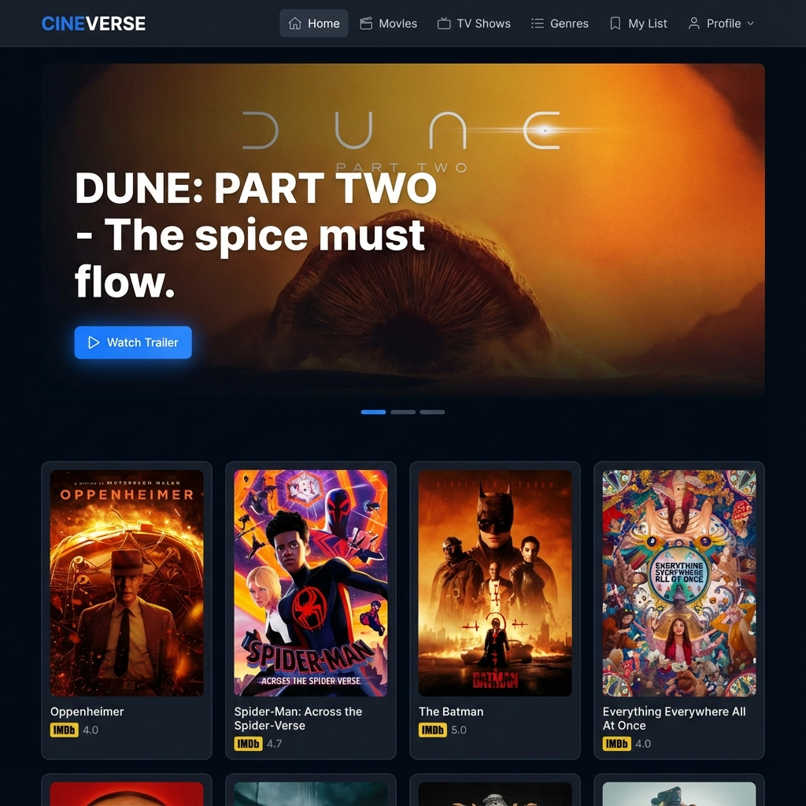
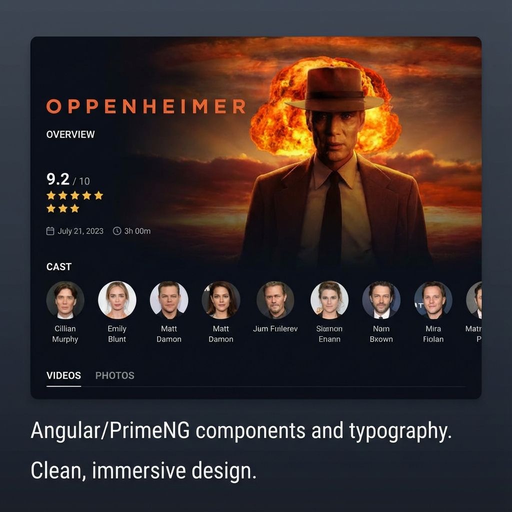

# Movies & TV Shows Library

A personal project recreating a Movies/TV Shows library using Angular 16. This application allows users to browse, search, and view details about their favorite movies and TV shows.

## Features

- **Browse Content**: Explore lists of popular, top-rated, and upcoming Movies and TV Shows.
- **Search**: Search for specific titles across both categories.
- **Detailed Views**: View comprehensive information including overview, cast, rating, and runtime.
- **Trailers**: Watch trailers directly within the application (where available).
- **Genres**: Filter content by genres.
- **Pagination**: Navigate through large sets of results.
- **Responsive Design**: Optimized for different screen sizes.

## Tech Stack

- **[Angular](https://angular.io/) v16**: Core framework.
- **[PrimeNG](https://primeng.org/)**: UI Component library.
- **[PrimeFlex](https://primeflex.org/)**: CSS utility library.
- **[TypeScript](https://www.typescriptlang.org/)**: Primary language.
- **[TMDb API](https://www.themoviedb.org/documentation/api)**: Source for movie and TV show data.

## Installation

1. **Clone the repository:**
   ```bash
   git clone https://github.com/femisowems/movies-tvs-library.git
   cd movies-tvs-library
   ```

2. **Install dependencies:**
   ```bash
   npm install
   ```

## Development Server

Run `ng serve` for a dev server. Navigate to `http://localhost:4200/`. The application will automatically reload if you change any of the source files.

```bash
npm start
# or
ng serve
```

## Build

Run `ng build` to build the project. The build artifacts will be stored in the `dist/` directory.

```bash
npm run build
```
## Available Scripts

In the project directory, you can run:

### `npm start`
Runs the app in the development mode.\
Open [http://localhost:4200](http://localhost:4200) to view it in the browser.

The page will reload if you make edits.

### `npm run build`
Builds the app for production to the `dist/` folder.\
It correctly bundles Angular in production mode and optimizes the build for the best performance.

### `npm test`
Launches the test runner in the interactive watch mode.

### `npm run watch`
Builds the application in watch mode, rebuilding on file changes.

## Screenshots





## License

MIT

**Free Software, Hell Yeah!**
